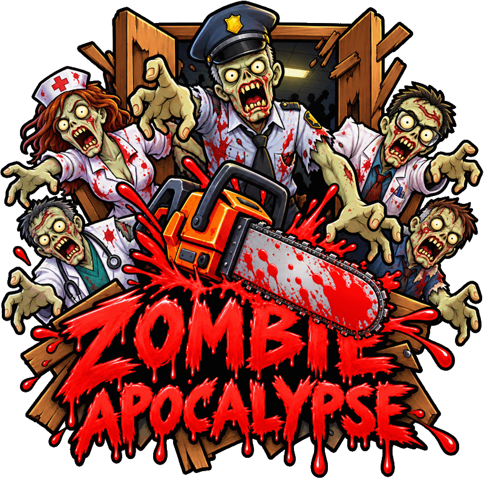

# Programming Digital Game Engines

![LIT](https://img.shields.io/badge/Limerick%20Institute%20of%20Technology-2017-red?style=flat-square&logo=data:image/svg+xml;base64,PD94bWwgdmVyc2lvbj0iMS4wIiBlbmNvZGluZz0iVVRGLTgiIHN0YW5kYWxvbmU9Im5vIj8+CjwhLS0gQ3JlYXRlZCB3aXRoIElua3NjYXBlIChodHRwOi8vd3d3Lmlua3NjYXBlLm9yZy8pIC0tPgoKPHN2ZwogICB3aWR0aD0iNTYuMzI5OTQ4bW0iCiAgIGhlaWdodD0iNTYuODY3NzgzbW0iCiAgIHZpZXdCb3g9IjAgMCA1Ni4zMjk5NDggNTYuODY3NzgzIgogICB2ZXJzaW9uPSIxLjEiCiAgIGlkPSJzdmcxIgogICB4bWw6c3BhY2U9InByZXNlcnZlIgogICB4bWxucz0iaHR0cDovL3d3dy53My5vcmcvMjAwMC9zdmciCiAgIHhtbG5zOnN2Zz0iaHR0cDovL3d3dy53My5vcmcvMjAwMC9zdmciPjxkZWZzCiAgICAgaWQ9ImRlZnMxIiAvPjxnCiAgICAgaWQ9ImxheWVyMSIKICAgICB0cmFuc2Zvcm09InRyYW5zbGF0ZSgtMTAwLjgwNjE2LC0xMTEuMDAxNTMpIj48cGF0aAogICAgICAgZD0ibSAxMjMuMzIyMzgsMTExLjYxNTU4IGMgMy43MDQxNiwtMC43NjcyOSA3LjUxNDE2LC0wLjgyMDIxIDExLjI0NDc5LC0wLjEzMjI5IGwgLTIuMzU0NzksMTIuNDYxODcgYyAtMC45NTI1LC0wLjE4NTIgLTEuOTMxNDYsLTAuMjY0NTggLTIuOTEwNDIsLTAuMjY0NTggLTUuNzY3OTIsMCAtMTEuMDU5NTgsMy4xMjIwOCAtMTMuODM3NzEsOC4xNDkxNyBsIC00LjE4MDQyLC0yLjI3NTQyIGMgMi44ODM5NiwtNS4yMTIyOSA3Ljg1ODEzLC04LjkxNjQ2IDEzLjcwNTQyLC0xMC4xODY0NiB6IG0gNi42OTM5NSwyMi4xNzIwOCBjIC0wLjIzODEyLC0wLjAyNjQgLTAuNDc2MjUsLTAuMDUyOSAtMC43MTQzNywtMC4wNTI5IC0xLjY0MDQyLDAgLTMuMjAxNDYsMC43MTQzNyAtNC4yNTk3OSwxLjkzMTQ2IGwgLTIuNjk4NzUsLTIuMzU0OCBjIDEuNzcyNzEsLTIuMDEwODMgNC4zMTI3MSwtMy4xNDg1NCA2Ljk4NSwtMy4xNDg1NCAwLjM3MDQxLDAgMC43NjcyOSwwLjAyNjUgMS4xMzc3MSwwLjA3OTQgeiBtIDE5LjU1MjcxLDI1LjYzODEzIGMgLTYuNjY3NSw2LjcyMDQyIC0xNi4yMTg5Niw5LjY4Mzc1IC0yNS41MzIyOSw3Ljk2Mzk2IGwgMS40ODE2NywtNy43Nzg3NSBjIDYuNzIwNDEsMS4yNDM1NCAxMy41OTk1OCwtMC44OTk1OSAxOC40MTUsLTUuNzQxNDYgeiBtIC0xMy42Nzg5NiwtMTMuNDkzNzUgNC42MzAyMSw0LjU1MDgzIGMgLTMuNjc3NzEsMy43MzA2MyAtOC45OTU4Myw1LjM3MTA0IC0xNC4xNTUyMSw0LjQxODU0IGwgMS4xOTA2MywtNi4zNzY0NSBjIDAuNTU1NjIsMC4xMDU4MyAxLjEzNzcxLDAuMTU4NzUgMS43MTk3OSwwLjE1ODc1IDIuNTEzNTQsMCA0Ljg2ODMzLC0wLjk3ODk2IDYuNjE0NTgsLTIuNzUxNjcgeiBtIC0xNy42NDc3LDQuNzA5NTggYyAxLjAwNTQxLDEuMDA1NDIgMi4xNDMxMiwxLjg1MjA5IDMuMzg2NjYsMi41NCBsIC0yLjMyODMzLDQuMTUzOTYgYyAtMS42MTM5NiwtMC44OTk1OCAtMy4wOTU2MywtMi4wMTA4MyAtNC40MTg1NCwtMy4zMDcyOSBsIC01LjU4MjcxLDUuNjM1NjIgYyAtNS40NTA0MiwtNS4zMTgxMiAtOC41MTk1OCwtMTIuNjIwNjIgLTguNDkzMTMsLTIwLjI0MDYyIDAsLTEuNzk5MTcgMC4xNTg3NSwtMy41OTgzMyAwLjUwMjcxLC01LjM3MTA0IGwgNy44MDUyMSwxLjUwODEyIGMgLTAuMjM4MTIsMS4yNyAtMC4zNzA0MiwyLjU2NjQ2IC0wLjM3MDQyLDMuODYyOTIgMCwyLjQwNzcxIDAuNDIzMzQsNC43ODg5NiAxLjI0MzU1LDcuMDY0MzcgbCA0LjQ3MTQ1LC0xLjY0MDQxIGMgLTAuOTc4OTUsLTIuNjcyMjkgLTEuMjE3MDgsLTUuNTgyNzEgLTAuNjg3OTEsLTguMzg3MjkgbCA2LjM3NjQ2LDEuMjQzNTQgYyAtMC4xMDU4NCwwLjU4MjA4IC0wLjE1ODc1LDEuMTY0MTYgLTAuMTU4NzUsMS43NDYyNSAwLDIuNDg3MDggMS4wMDU0MSw0Ljg2ODMzIDIuNzc4MTIsNi41ODgxMiB6IG0gMjQuNTc5NzksLTI2LjY0MzU0IDYuNTA4NzUsMTAuOTI3MjkgYyAwLjU1NTYyLDIuNDA3NzEgMC42NjE0NSw0LjkyMTI1IDAuMzE3NSw3LjM1NTQyIEwgMTM4LjQ4MywxNDAuNzE5NzUgYyAtMC4xMzIyOSwwLjk3ODk2IC0wLjQyMzMzLDEuOTA1IC0wLjg0NjY3LDIuODA0NTggbCAtMy4yNTQzNywtMS41NjEwNCBjIDEuMTM3NzEsLTIuMzAxODggMC42MDg1NCwtNS4xMDY0NiAtMS4zNDkzOCwtNi43OTk3OSBsIDIuMzU0OCwtMi42OTg3NSBjIDEuNDgxNjYsMS4yOTY0NiAyLjUxMzU0LDMuMDE2MjUgMi45MzY4Nyw0LjkyMTI1IGwgNi4zNSwtMS40Mjg3NSBjIC0wLjc0MDgzLC0zLjI1NDM4IC0yLjQ4NzA4LC02LjE5MTI1IC01LjAwMDYzLC04LjM4NzI5IHogbSA2LjUzNTIsMTAuOTAwODMgLTYuNTA4NzUsLTEwLjkyNzI5IGMgLTEuMzc1ODMsLTEuMjE3MDggLTIuOTEwNDEsLTIuMjIyNSAtNC41NTA4MywtMy4wMTYyNSBsIDMuNDY2MDQsLTcuMTQzNzUgYyA3LjgwNTIxLDMuNzgzNTQgMTMuNDY3MjksMTAuOTAwODQgMTUuMzcyMjksMTkuMzQxMDQgeiIKICAgICAgIHN0eWxlPSJmaWxsOiNkNzFkMWU7c3Ryb2tlLXdpZHRoOjAuMjY0NTgzIgogICAgICAgaWQ9InBhdGgxLTgiIC8+PC9nPjxzdHlsZQogICAgIHR5cGU9InRleHQvY3NzIgogICAgIGlkPSJzdHlsZTEiPgoJLnN0MHtmaWxsOiNENzFEMUU7fQo8L3N0eWxlPjwvc3ZnPgo=)

---

### Limerick Institute of Technology
####  Year 4 (2017/18), Semester 7

**Student Name**: Joe O'Regan  
**Student Number**: A00258304  
**Course**: BSc Computing (Games Design and Development)  
**Module**: Programming Digital Game Engines

---

## Assignment 1: Zombie Apocalypse (18/01/2018)

[Play Level 1 on itch.io](https://joeoregan.itch.io/za1)  
[Play Level 2 on itch.io](https://joeoregan.itch.io/za2)  
[Play Level 3 on itch.io](https://joeoregan.itch.io/za3)

> [!TIP]
> Aim for the head!!!

Zombie Apocalypse is a 3D First Person Shooter (FPS), created in Unity as part of the CA for the fouth-year Programming Digital Game Engines module of my Game Design and Development course. The game is coded in C#.

#### YouTube Videos and SoundCloud Audio Tracks:

###### Other Links:

- [Trailer YouTube (Created as part of assignment](https://youtu.be/bVB-Gp3zN5s "Zombie Apocalypse Trailer on YouTube")
- [Gameplay on YouTube](https://youtu.be/V1eb564VPUw "Zombie Apocalypse Gameplay on YouTube")
- [Target Practice on YouTube](https://youtu.be/Zo_g516evQE "Zombie Apocalypse Target Practice on YouTube")
- [Last Minute Random Bits Added on YouTube](https://youtu.be/IDp3Z8KcD6o "Zombie Apocalypse Last Minute Random Bits Added on YouTube")
- [Original Game Audio Tracks on SoundCloud](https://soundcloud.com/joeoregan/sets/zombie-apocalypse "Original Game Audio Tracks on SoundCloud")

---

## Screenshots

###### Zombie Apocalypse Title Screens

###### Level 1: Security Building, Target Practice, Practice Zombies (For Testing Weapons)

###### Level 2: Passageways to underground laboratory

###### Level 3: Great hall and underground research lab

###### Menu

---

<h2>Assignment Spec</h2>

Click to expand

You are required to create a 3D game using Unity 2017.1.x based on the theme Shoot ‘em up

Requirements for the game are as follows

1. The game must have a minimum of **1 level** and a maximum of **3 levels**
2. Each level must last at least **1 minute**
3. The levels should **progress in difficulty** i.e. 1st level easy, 2nd level medium, 3rd level more difficult
4. Each submission must include a Design Document
5. A submission of 1 level will be weighted at 0.6 a submission of 2 levels will be weighted at 0.75 a submission of 3 level will be weighted at 1.0
6. You may be required to demo the game to your lecturer
7. The project and asset file as well as the binary release must be burned to a DVD. The lecturer will copy the DVD to his C drive and load it in to Unity to examine the project and play the game. Include a README.txt with the DVD which explains how to open and play the game in Unity
8. The Design Document template is available on Moodle in the 4th year project resources section. In the Misc section describe your Unity implementation and the approach you took.
9. Provide a 30 seconds to 1 minute video [trailer](https://youtu.be/bVB-Gp3zN5s) showing actual game footage for your game.

---

&copy; 2017 Joe O'Regan &bull; LIT | Programming Digital Game Engines

[⬆️ Back to Top](https://github.com/joeaoregan/LIT-Yr4-DigitalGameEngines)

