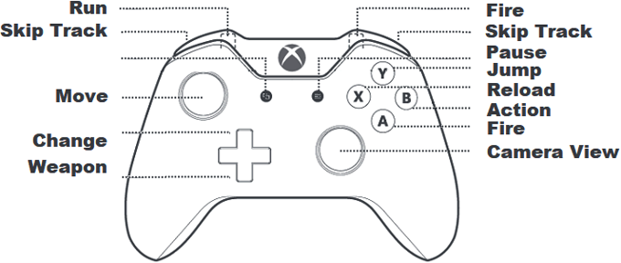
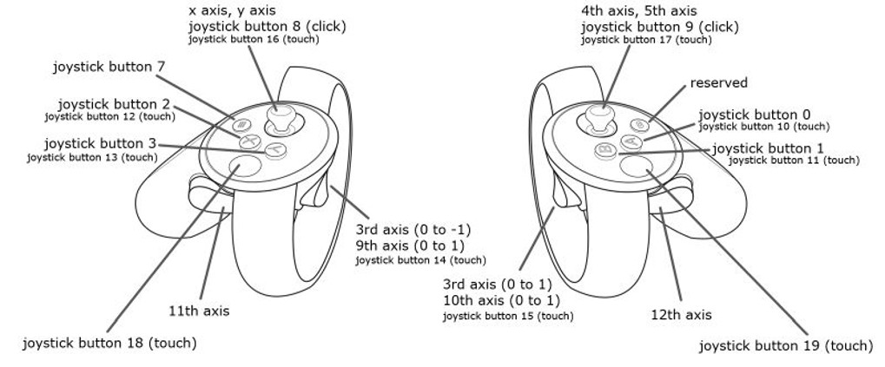

# Controls

## Controller

    Game Controller button layout

    Meta Quest controllers button layout

## Keyboard and mouse

| Action | Keyboard / mouse |
| --- | --- |
| Move | `WASD` or arrow keys |
| Look around | Mouse |
| Shoot | Left mouse button or `Left Ctrl` |
| Reload | `R` |
| Interact, pick up, or open | `E` |
| Jump | `Space` or middle mouse button |
| Run | Hold `Shift` while moving |
| Switch weapon | Numpad `+` / Numpad `-` |
| Pause | `Esc` |

In the WebGL build, use `E` for interaction. Browser pointer-lock and context-menu handling can make right-click unreliable.

## Weapons

The game has three weapons: the M9 pistol, chainsaw, and crowbar. Weapons become available as you progress through the game. Use the numpad plus and minus keys to cycle through weapons.

## Music

| Action | Key |
| --- | --- |
| Previous track | `,` |
| Next track | `.` |

You can also shoot the Hi-Fi system or wall speakers to change the current track.