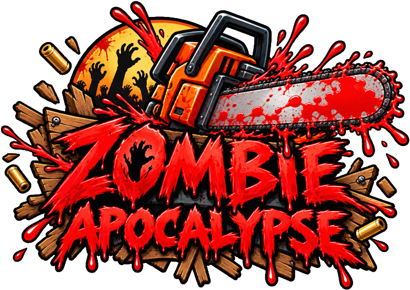

# Zombie Apocalypse

An experimental Unity first-person zombie shooter created as a college Digital Game Engines project.

- [Play Level 1 on itch.io](https://joeoregan.itch.io/za1)
- [Play Level 2 on itch.io](https://joeoregan.itch.io/za2)

## Gameplay

- [Level 1](level1.md)
- [Level 2](level2.md)
- [Level 3](level3.md)

## Controls

- [Game Controls](controls.md)

## Project notes

The game was designed for PC keyboard and mouse play, with early support and experiments for gamepad, Oculus Rift, and world-space UI. It combines a first-person controller, NavMesh zombie movement, animated objectives, 3D audio, weapon pickups, headshots, and deliberately silly environmental interactions.

The report in the repository's `dev` folder contains the longer design history, implementation notes, screenshots, and appendices from the original submission.

