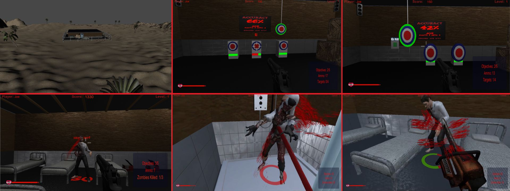

# Level 1

## Security building

Level 1 begins in the research facility's security building. Explore the shooting range, storage room, and dormitory while learning the game's movement, shooting, and interaction controls.

## Objectives

    Level 1 Objectives

1. Find and pick up the M9 pistol.
2. Find ammunition.
3. Complete the target range by destroying all four targets.
4. Survive the zombie encounter and defeat the required zombies.
5. Find and open the exit to continue.

The target range includes a moving target, an accuracy scoreboard, and an optional easy-mode switch that makes the practice targets larger.

## Interactions

The building contains optional interactions including the Hi-Fi system, CCTV screens, arcade machine, golden gun ornament, beds, shower, bass guitar, posters, sink, toilet, vehicle, oil drums, and other environmental objects. Some interactions play sounds or display random messages rather than advancing the objectives.

