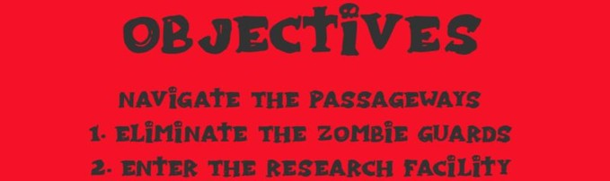
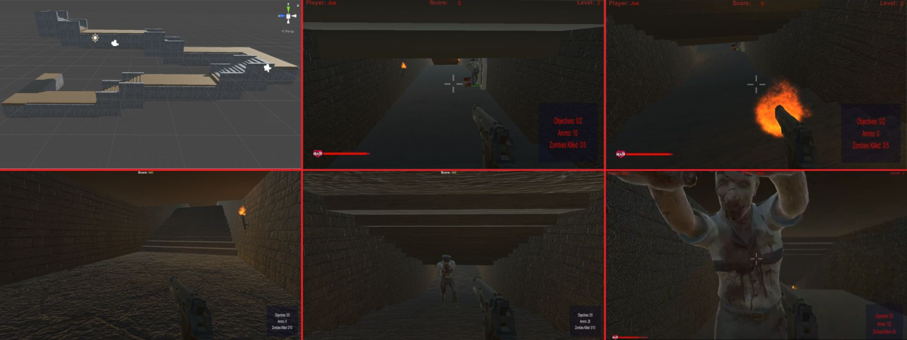

# Level 2

## Passageways

Level 2 moves the player into the underground passageways leading toward the laboratory. It is more open and fast-moving than Level 1, with zombies spawning from the surrounding routes.

## Objectives

    Level 2 Objectives

1. Defeat the required zombies.
2. Find the laboratory door and continue through the passageways.

Keep moving, conserve ammunition, and use the environment to create distance from the zombies. Ammunition pickups return after a short delay in the WebGL build.

## Interactions

The passageways include doors, torches, speakers, and other environmental interactions. Shooting speakers changes the music track. Use `E` near an interactive door or switch.

