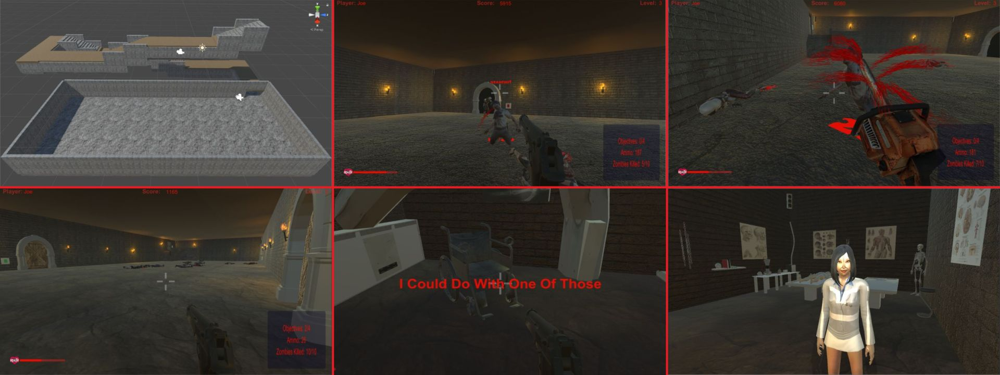

# Level 3

## Great hall and laboratory

Level 3 is the final combat area: a larger underground hall surrounded by archways and research-facility spaces. Zombies emerge from the surrounding routes after the relevant door interaction is triggered.

## Objectives

    Level 3 Objectives

1. Defeat the zombie horde.
2. Close the zombie spawn doorways.
3. Reach the laboratory.
4. Open the lab door and find the girl.

The laboratory contains medical equipment, posters, x-rays, a wheelchair, torches, and other environmental details. The final sequence begins after opening the inner lab door.

## Notes

Level 3 was designed as a deathmatch-style encounter with random zombie spawning and a stronger focus on movement, positioning, and crowd control.