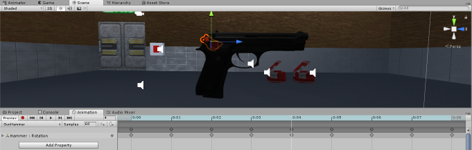
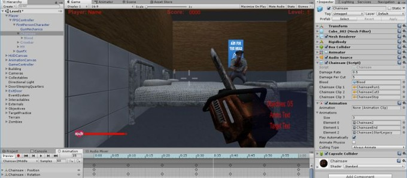
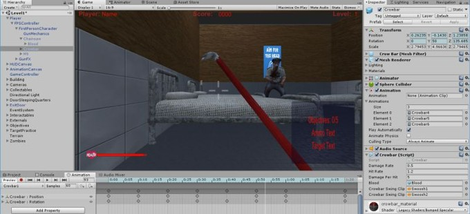

# Weapons

The player can use three main weapons. Switch between available weapons with numpad `+` and numpad `-`.

## M9 pistol

    M9 Pistol

The pistol is the starting weapon objective in Level 1. Find it in the security building, collect ammunition, and use the shooting range to practise. Left-click fires, and `R` reloads.

Headshots deal special damage and award bonus score. The pistol is also the most useful weapon for shooting targets, zombies, and music speakers.

## Chainsaw

    Chainsaw

The chainsaw is a close-range weapon with looping start, running, cutting, and stop audio. It becomes available after progressing through the earlier weapon objectives. Hold the fire button while close to a zombie to deal repeated damage.

## Crowbar

    Crowbar

The crowbar is another close-range weapon that becomes available later than the pistol and chainsaw. It is useful when ammunition is low and supports the same close-quarters combat style.

## Weapon progression

Level 1 deliberately introduces the weapons in stages:

1. Find the pistol.
2. Collect ammunition and complete target practice.
3. Defeat the required zombies.
4. Pick up later weapons when their progression requirements are met.

The project also contains ornamental weapons, such as the Sai, which are present as environmental details rather than fully usable weapons.
